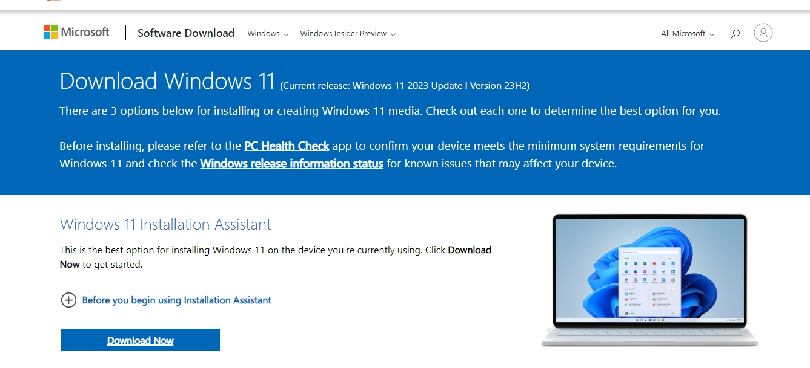
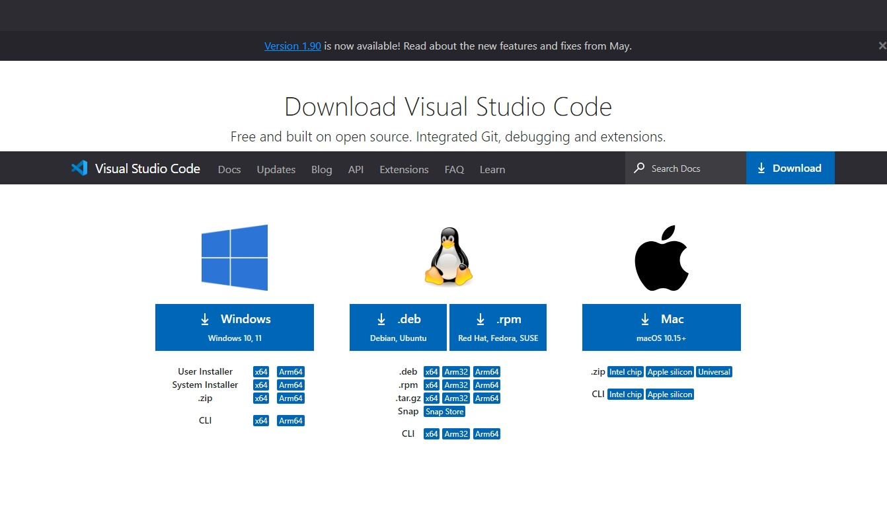

# Dev_Setup
Setup Development Environment

#Assignment: Setting Up Your Developer Environment

#Objective:
This assignment aims to familiarize you with the tools and configurations necessary to set up an efficient developer environment for software engineering projects. Completing this assignment will give you the skills required to set up a robust and productive workspace conducive to coding, debugging, version control, and collaboration.

#Tasks:

1. Select Your Operating System (OS):
   Choose an operating system that best suits your preferences and project requirements. Download and Install Windows 11. https://www.microsoft.com/software-download/ 
      Operating System Installation
         1.Download Windows 11

   Visit the Microsoft website Choose Windows 11: Download and install Windows 11 from the Microsoft Windows 11 download page.

   Download the installer and follow the on-screen instructions to install Windows 11.

   

   

2. Install a Text Editor or Integrated Development Environment (IDE):
   Select and install a text editor or IDE suitable for your programming languages and workflow. Download and Install Visual Studio Code. https://code.visualstudio.com/Download
    IDE Installation
       2.Download Visual Studio Code:

Visit the Visual Studio Code download page.
Download the installer for your operating system.
Run the installer and follow the on-screen instructions to complete the installation.
Create a desktop icon.
Launch the VS Code and install recommended extensions like python.

3. Set Up Version Control System:
   Install Git and configure it on your local machine. Create a GitHub account for hosting your repositories. Initialize a Git repository for your project and make your first commit. https://github.com
   Install Git:
Download Git from the official Git website.
Run the installer and follow the setup instructions, choosing the preferred options for the path.

-1.png>)

Use git bash to check the version of the git that has been installed(git --version)

   Create a GitHub Account:
   Go to GitHub and sign up for a free account.
   
   Initialize a Git Repository:
Open Visual Studio Code.
Open a new terminal.
Navigate to your project directory.
To intialize a new repository; use git init, make the first commit by using git add . then git commit so that it can reflect on the github account created.

4. Install Necessary Programming Languages and Runtimes:
  Instal Python from http://wwww.python.org programming language required for your project and install their respective compilers, interpreters, or runtimes. Ensure you have the necessary tools to build and execute your code.
  Install Python:

Visit the Python downloads page.
Download the installer for the latest version of Python.
Run the installer and ensure you check the box to add Python to your PATH during installation.
Verify the installation by running the git bash to check its version.

.png>)

Select the “Windows installer” option and click on the “Download” button. Once the download is complete, run the installer.Check the boxes and “Add python.exe to PATH”.
Follow all the on-screen instructions and python will be verfied to have been downloaded.

5. Install Package Managers:
   If applicable, install package managers like pip (Python).

   Check for pip version which is inbuilt in the python after the download is done by using the bash and running( pip --vesion).

6. Configure a Database (MySQL):
   Download and install MySQL database. https://dev.mysql.com/downloads/windows/installer/5.7.
      Download and Install MySQL:
Go to the MySQL download page.

.png>)

Download the MySQL installer depending on the windows of your pc.
Run the installer and follow the setup wizard to install MySQL Server.
To see the steps required for the installation, us MYSQL documentation on the browser for it to be installed successfully. https://phoenixnap.com/kb/install-mysql-on-windows

7. Set Up Development Environments and Virtualization (Optional):
   Consider using virtualization tools like Docker or virtual machines to isolate project dependencies and ensure consistent environments across different machines.
   Install Docker:

Visit the Docker download page.
Download Docker Desktop for Windows.
Install Docker and follow the setup instructions.
Verify the installation by running docker --version on git bash.

8. Explore Extensions and Plugins:
   Explore available extensions, plugins, and add-ons for your chosen text editor or IDE to enhance functionality, such as syntax highlighting, linting, code formatting, and version control integration.
   Install Visual Studio Code Extensions:
Open Visual Studio Code.
Go to the Extensions view.
Install various extentions for the vs code like, python, prettier, pylance and other extensions that are required.

9. Document Your Setup:
    Create a comprehensive document outlining the steps you've taken to set up your developer environment. Include any configurations, customizations, or troubleshooting steps encountered during the process. 

      Setup Process Document:

Operating System:
Installed Windows 11 from Microsoft's website.
IDE Installation:
Installed Visual Studio Code from Visual Studio Code's website.
Version Control System:
Installed Git from Git's website.
Created a GitHub account and initialized a Git repository for the project.
Made the first commit to the repository.
Programming Languages and Runtimes:
Installed Python from Python's website.
Package Managers:
Installed pip which is default when the python installation is successful.
Database (MySQL):
Downloaded and installed MySQL from MySQL's website.
Configured MySQL server.
Extensions and Plugins:
Explored available extensions in Visual Studio Code for Python development, such as Python, Pylance, and Prettier.
GitHub Repository:
Created a GitHub repository containing a sample project initialized with Git.

A GitHub repository containing a sample project initialized with Git and any necessary configuration files (e.g., .gitignore):

https://github.com/sheewanjiru/Ecommerce_with_D.git

CHALLENGES FACED DURING THE SETUP:
   Navigating through the installation of MYSQL. SOLUTION:Using the documentation guide to help in the installation process.

   Downloading issues on my PC. SOLUTION:Making sure that the PC has the right state like the RAM and bits to perform the necessary installation successfully.
#Deliverables:
- Document detailing the setup process with step-by-step instructions and screenshots where necessary.
- A GitHub repository containing a sample project initialized with Git and any necessary configuration files (e.g., .gitignore).
- A reflection on the challenges faced during setup and strategies employed to overcome them.

#Submission:
Submit your document and GitHub repository link through the designated platform or email to the instructor by the specified deadline.

#Evaluation Criteria:**
- Completeness and accuracy of setup documentation.
- Effectiveness of version control implementation.
- Appropriateness of tools selected for the project requirements.
- Clarity of reflection on challenges and solutions encountered.
- Adherence to submission guidelines and deadlines.

Note: Feel free to reach out for clarification or assistance with any aspect of the assignment.
